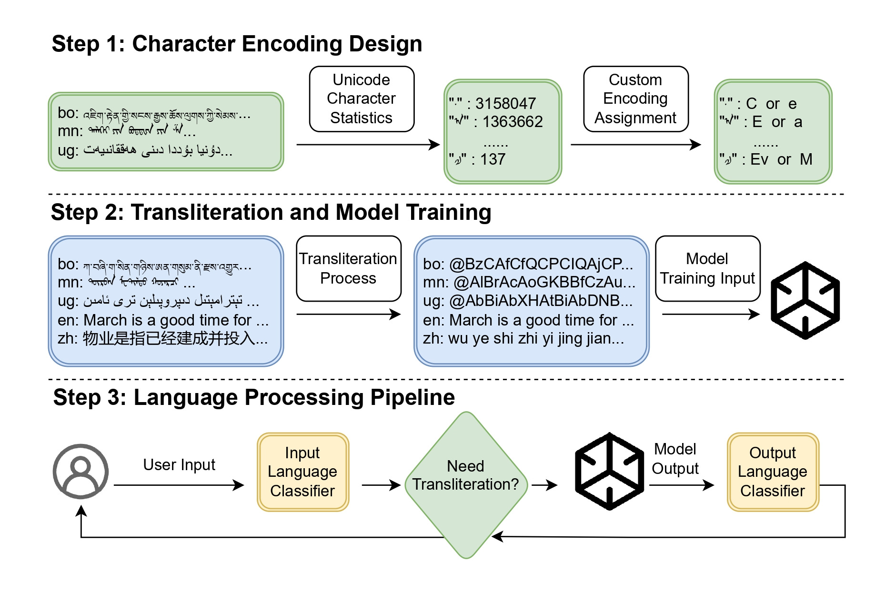

# HuffmanTranslit: Reversible Transliteration for Low-Resource Languages

<div align="center">
  
  <br><br>
  
  [](https://www.python.org/downloads/)
  [](https://opensource.org/licenses/MIT)
  [](https://aclanthology.org/2025.acl-long.795/)
</div>

**HuffmanTranslit** is a novel framework for enhancing cross-lingual transfer in large language models through reversible transliteration of low-resource languages. Our approach combines character transliteration with Huffman coding principles to achieve compression, accuracy, efficiency, and scalability for **any character-based writing system**.

## 🎯 Key Features

- **100% Lossless Conversion**: Guaranteed reversible transliteration between original scripts and Latin representations
- **High Compression**: Up to 50% reduction in file size and 50-80% reduction in token count
- **Language Agnostic**: Framework can be easily extended to any language with character-based writing systems
- **Multi-Strategy Support**: Three progressive transliteration strategies (Basic, Tokenizer-optimized, Hybrid)
- **Easy Integration**: Simple API for seamless integration into existing NLP pipelines

*Note: We currently provide pre-built character mappings for Tibetan, Mongolian, and Uyghur ([basic](data/character_mappings/basic_mapping.json) and [optimized](data/character_mappings/optimized_mapping.json)), but the framework supports any language.*

## 🚀 Quick Start

### Installation

```bash
git clone https://github.com/CMLI-NLP/HuffmanTranslit.git
cd HuffmanTranslit
pip install -r requirements.txt
```

### Basic Usage

```python
from src.core.transliterator import create_transliterator

# Create a transliterator with optimized encoding (recommended for Tokenizer strategy)
transliterator = create_transliterator('optimized')  # or 'basic' for Basic strategy

# Transliterate text to Latin representation
tibetan_text = "འཇིག་རྟེན་གྱི་སངས་རྒྱས་ཆོས་ལུགས།"
latin_text = transliterator.transliterate_to_latin(tibetan_text)
print(f"Latin: {latin_text}")

# Restore original text (100% lossless)
restored_text = transliterator.transliterate_from_latin(latin_text)
print(f"Restored: {restored_text}")
print(f"Lossless: {tibetan_text == restored_text}")  # True
```

### Run Examples

```bash
# Basic transliteration demo
python examples/basic_demo.py

# Compression analysis demo  
python examples/compression_demo.py
```

## 🌍 Language Support & Extensibility

### Currently Supported Languages
We provide pre-built character mappings for:

| Language | ISO Code | Script | Character Mappings |
|----------|----------|--------|--------------------|
| Tibetan | bo | Tibetan script | ✅ [Basic](data/character_mappings/basic_mapping.json) & [Optimized](data/character_mappings/optimized_mapping.json) |
| Mongolian | mn | Traditional Mongolian | ✅ [Basic](data/character_mappings/basic_mapping.json) & [Optimized](data/character_mappings/optimized_mapping.json) |
| Uyghur | ug | Uyghur Arabic script | ✅ [Basic](data/character_mappings/basic_mapping.json) & [Optimized](data/character_mappings/optimized_mapping.json) |

### Extending to New Languages
The framework is **language-agnostic** and can be easily extended to any character-based writing system:

```python
from src.utils.char_analyzer import CharacterAnalyzer

# Step 1: Analyze character frequencies in your corpus
analyzer = CharacterAnalyzer()
analyzer.analyze_file('your_language_corpus.txt')

# Step 2: Generate optimized character mappings
mappings = analyzer.create_basic_mapping(num_chars=200)  # Adjust as needed
analyzer.save_mapping_json(mappings, 'your_language_mapping.json')

# Step 3: Use with the transliterator
from src.core.transliterator import HuffmanTransliterator
transliterator = HuffmanTransliterator('your_language_mapping.json')
```

### Theoretical Capacity
The encoding scheme is **fully extensible** and can handle virtually unlimited characters by increasing code length:
- Length 1-4: Up to 475,254 unique characters
- Length 5+: Millions more characters possible

This makes it suitable for:
- Any natural language
- Historical scripts
- Specialized notation systems
- Multi-script documents

## 🏗️ How It Works

### Three-Stage Pipeline
1. **Character Encoding Design**: Analyze character frequencies and assign optimal codes
2. **Transliteration**: Convert text using frequency-based character mappings  
3. **Restoration**: Losslessly restore original text from Latin representation

### Encoding Strategies (Recommended)
- **Basic**: Simple frequency-based Latin encoding (1.63× compression) - *uses basic mapping*
- **Tokenizer**: LLaMA2 single-token optimization (2.35× compression) - *uses optimized mapping*
- ~~Hybrid~~: *Not recommended for general use*

We provide character mappings for both recommended strategies: [basic_mapping.json](data/character_mappings/basic_mapping.json) and [optimized_mapping.json](data/character_mappings/optimized_mapping.json).

## 📚 Datasets

- **CUTE Multilingual Dataset**: [https://huggingface.co/datasets/CMLI-NLP/CUTE-Datasets](https://huggingface.co/datasets/CMLI-NLP/CUTE-Datasets)
- **Mongolian Pretraining Dataset**: [https://huggingface.co/datasets/CMLI-NLP/Mongolian-pretrain-dataset](https://huggingface.co/datasets/CMLI-NLP/Mongolian-pretrain-dataset)

## 📖 Citation

If you use this work in your research, please cite our ACL 2025 paper:

```bibtex
@inproceedings{zhuang2025enhancing,
  title={Enhancing Cross-Lingual Transfer through Reversible Transliteration: A Huffman-Based Approach for Low-Resource Languages},
  author={Zhuang, Wenhao and Sun, Yuan and Zhao, Xiaobing},
  booktitle={Proceedings of the 63rd Annual Meeting of the Association for Computational Linguistics (Volume 1: Long Papers)},
  pages={16299--16313},
  year={2025}
}
```

## ⚡ Requirements

- Python 3.8+
- transformers >= 4.20.0
- uroman (optional, for comparison)
- tqdm, pathlib

## 📄 License

This project is licensed under the MIT License - see the [LICENSE](LICENSE) file for details.

## 📞 Contact

- **Wenhao Zhuang**: sdrz_zwh@163.com
- **Yuan Sun**: sunyuan@muc.edu.cn (Corresponding author)
- **Xiaobing Zhao**: nmzxb_cn@163.com

## 🔗 Related Resources

- [ACL 2025 Paper](https://aclanthology.org/2025.acl-long.795/)
- [CUTE Dataset](https://huggingface.co/datasets/CMLI-NLP/CUTE-Datasets)
- [Mongolian Dataset](https://huggingface.co/datasets/CMLI-NLP/Mongolian-pretrain-dataset)

---

*Ready to extend to your language? Check out our character analysis tools and create your own mappings!*
